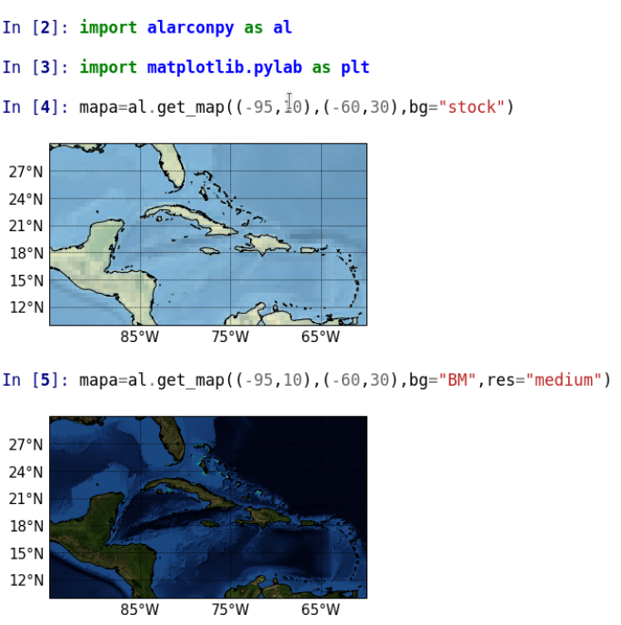
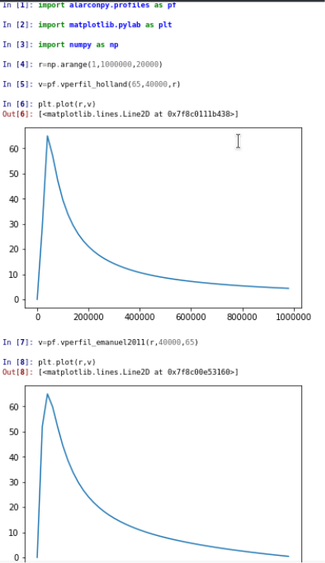
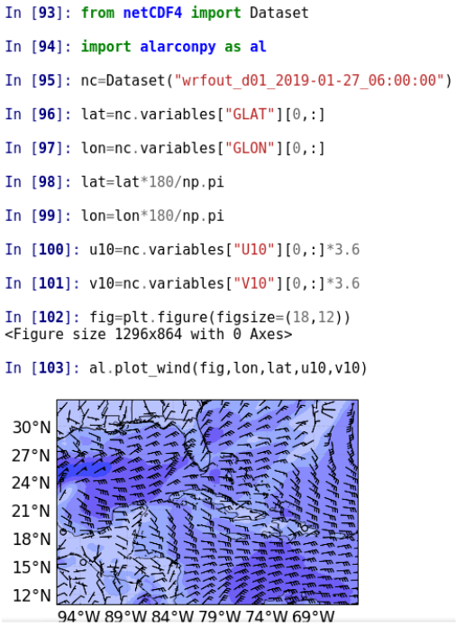

# Alarconpy: A Python Package for Meteorologists

Alarconpy is a tools collection in Python programming language that offers many functions and algorithms for several meteorological applications as well as for a quickly processing of weather data. It includes, among other, functions for calculating some atmospheric variables such as saturation vapor pressure and relative humidity, units converting, maps creation, predefined color palettes for plotting meteorological variables and some tropical cyclones applications such as radial wind profiles.
It also contains in a same function the facilities of other Python packages benefiting existing and future users.

# Alarconpy requirements

Alarconpy is developed for Python 3.x and there are some python libraries required for use it:

- Numpy: It is the fundamental package for scientific computing with Python. It contains among other things: a powerful N-dimensional array object, sophisticated functions and useful linear algebra, Fourier transform, and random number capabilities. The NumPy array object is the common interface for working with typed arrays of data across a wide-variety of scientific Python packages. NumPy also features a C-API, which enables interfacing existing Fortran/C/C++ libraries with Python and NumPy (https://www.scipy.org).

- Metpy: It is a modern meteorological open-source toolkit for Python. It is a maintained project of Unidata  to serve the academic meteorological community. MetPy consists of three major areas of functionality: Plots, Calculations and File Input/Output (https://unidata.github.io/MetPy/latest/index.html)

- Cartopy: It is a Python package designed for geospatial data processing in order to produce maps and other geospatial data analyses. It makes use of the powerful PROJ.4, NumPy and Shapely libraries and includes a programmatic interface built on top of Matplotlib for the creation of publication quality maps.

- Scipy: It is one of the core packages that make up the SciPy stack. It provides many user-friendly and efficient numerical routines, such as routines for numerical integration, interpolation, optimization, linear algebra, and statistics.

- NetCDF4: It is the Python interface to the netCDF C library. This module can read and write files in both the new netCDF 4 and the old netCDF 3 format, and can create files that are readable by HDF5 clients (https://unidata.github.io/netcdf4-python/netCDF4/index.html).

- Matplotlib: It is a plotting library for the Python programming language and its numerical mathematics extension NumPy  (https://matplotlib.org). Also, it is a sophisticated library capable of producing publication-quality graphics in a variety of formats, and with full LaTeX support.

- Time: This module provides various time-related functions (https://docs.python.org/3/library/time.html.

# Alarconpy examples
<b>Plotting maps</b>

Figure shows the use of the Alarconpy to create a geographic map with Cartopy. As can be seen in
practically one line of code (without count the lines to import required packages), a geographic map was
created, while making this same map using directly Cartopy package it is required at least of 10 lines of
code.


The <b>get_map(arguments*)</b> function contains the possibility to use new backgrounds for the maps, as shown in the Figure 2 on the bottom map, where the Blue Marble (https://neo.sci.gsfc.nasa.govview.php?datasetId=BlueMarbleNG-TB) background was used. It also allows to change the resolution of the map background, the font size and the interval to draw the parallels and meridians.

<b> Operations with time</b>

Many meteorological data files contain the date in Unix Time format (number of seconds elapsed since
the start of the Unix epoch at 1 January 1970 00:00:00 UTC). The Alarconpy package provides a
function to convert the date in Unix Time to Julian date. The following code shows the use of the
<b>time calc(arguments*)</b> function:

```
import alarconpy as al

Out[2]: str(al.time_calc("1970-01-01 00:00:00",1592094920.964/3600.))
Out[3]: '2020-06-14 00:35:20.964000'
```
It also includes a function to calculate the total hours elapsed between two dates:
```
Out[3] al.time_dif("20200610000000","20200612000000")
Out[3]: 48
```
<b>Interpolation methods</b>

As mentioned above, Alarconpy includes the Scipy and Metpy interpolation methods in the same function, which facilitates the implementation of any of them easily and quickly. Available interpolation methods are  "linear", "nearest", "cubic" and "rbf" from Scipy and  "natural_neighbor","barnes" and "cressman" from  Metpy. Below is an example of the use of some of them.
```
import alarconpy as al

In [2]: print(points)
[[-99.875   5.125]
 [-99.625   5.125]
 [-99.375   5.125]
 ...
 [-15.375  35.125]
 [-15.125  35.125]
 [-14.875  35.125]]
 
In [3]:  print(ipoints)
[[-50.  22.]] 


In [4]: print(sst)
[[28.27 28.31 28.40 ...
  28.85 28.70 28.63]
 [28.61 28.61 28.63 ...
  28.84 28.68 28.61]
 [28.77 28.76 28.76 ...
  28.89 28.73 28.65]
 ...
 [--  19.60 19.61 19.60]
 [--  19.53 19.56 19.55]
 [--  19.52 19.55 19.56]]

In[5]: al.points_interpolation(points,sst.flatten(),ipoints,interp_type="linear")
Out[5]: array([26.3949995])

In[6]: al.points_interpolation(points,sst.flatten(),ipoints,interp_type="natural_neighbor")
Out[6]: array([26.39])

In[7]: al.points_interpolation(points,sst.flatten(),ipoints,interp_type="nearest")
Out[7]: array([26.44999885559082])

In[8]: al.points_interpolation(points,sst.flatten(), ipoints,interp_type="cubic")
Out[8]: array([26.37522029])
```
 
<b>Units conversion</b>

This python package presented in this article includes a function that allows unit conversion. Supports conversion of units, among others, in acceleration, angle, area, moment of inertia, density, length, mass, temperature and velocity. Below is shown an example:
```
import alarconpy as al

In[2]:al.units_conversion( 1,"knots", "m/s" )
Out[2]: 0.514444

In[3]:al.units_conversion( 1,"km", "m" )
Out[3]: 1000

In[4]: al.units_conversion( 300,"degK", "degC" )
Out[4]: 26.850000000000023
```

<b> Color palettes</b>

Alarconpy includes several color palettes for representing different meteorological variables. Figure shows an example of their use. The color palettes developed in Alarconpy are in agreement with the color palettes used for plotting the corresponding meteorological variables at the Cuban Institute of Meteorology. 


<b> Tropical cyclones modules</b>

The radial wind profiles of tropical cyclones are a powerful tool for describing the radial wind structure of
these storms. Alarconpy incorporates a module with the implementation of several radial wind profiles:
Holland (1980), DeMaria (1987), Emanuel (2004), Willoughby et al. (2006), Emanuel and Rotunno
(2011), Frisius and Scgönemann (2013) and Chavas et al. (2015). Figure  shows an example of using the
<b>profiles module</b> to obtain the TC radial wind structure from Holland (1980) and Emanuel and Rotunno
(2011) radial wind profiles.



For the study of the risk associated with the impact of TCs on a certain geographic area, it is
important to make a mask of the area occupied by the TC that allows it to be distinguished from the
environment undisturbed by cyclonic circulation. Therefore, the function create <b>TCmask(arguments*)</b>
was incorporated into Alarconpy package, which allows to be performed quickly this mask, as shown in the following 
figure.


In several occasions, in order to provide an evaluation of the TCs track forecast, it is necessary to calculate the distance between two geographic locations. The python package presented in this article includes the implementation of the Haversine function for calculating the distance between two geographic coordinates. The code segment below shows the simplicity of its use. 
```
import alarconpy as al

lat1=22.5

lon1=-74.3

lat2=23.8

lon2=-83.2

al.haversine((lat1,lon1),(lat2,lon2),units='km')
Out[7]: 919.627811821197
```

<b>Text files</b>

One of the most important aspects of Alarconpy is the incorporation of the  <b>index_row(arguments*)</b> function, which allows  to quickly determine the indexes in which a certain character string is found in a list of string. The code presented below shows the use of this function to determine the position of Hurricane Irma (AL112017) entries  in the HURDAT2 database of the National Hurricane Center (NHC). The HURDAT2 database have a text format with contain information every six hours about the location, maximum winds, minimum central pressure of all known tropical and subtropical cyclones.

```
import alarconpy as al

hurdat=open("hurdat2-1851-2019-052520.txt","r")

hurdat=hurdat.readlines()

index=al.index_row(hurdat,"AL112017")

print(index)
[52180]

index=index[0]

hurdat[index]
Out[9]: 'AL112017,       IRMA,     66,\n'
```

<b> Plotting of meteorological variables</b>

Finally, Alarconpy has several functions for plotting some meteorological variables. These functions were  developed to plot the outputs of the Numerical Tools for Weather Forecast system (NTWF) and the Numerical Tools for Hurricane Forecast  system (NTHF), which are based on the NMM (Nonhydrostatic Mesoscale Model)) dynamic core of the WRF (Weather Research and Forecasting) model. Both were developed in the Department of Meteorology of the  Higher of Tecnologies and Applied Sciences,  University of Havana.  NTWF and NTHF outputs are available at https://www.instec.cu/model/models.php. Figure  shows an example of the use of this plotting functions.  



The Alarconpy's plotting functions could  be used to plot the outputs of any numerical weather forecast model or  any  meteorological data matrix which contains information of some meteorological variable included in this package.

# References
- Chavas, D. R., Lin, N., and Emanuel, K. A. (2015). A model for the complete radial structure of the
tropical cyclone wind field. part i: Comparison with observed structure. Journal of the Atmospheric
Sciences, 72:3647–3662. https://doi.org/110.1175/JAS-D-15-0014.1
- DeMaria, M. (1987). Tropical cyclone track prediction with a barotropic spectral model. Monthly Weather
Review, 115:2346–2357. https://doi/org/10.1175/1520-0493(1987)115,2346:TCTPWA.2.0.CO;2
- Emanuel, K. and Rotunno, R. (2011). Self-stratification of tropical cyclone outflow. Part I: Implications
for storm structure. Journal of the Atmospheric Sciences, 68:82236–2249. https://doi.org/10.1175/JAS-D-10-05024.1
- Emanuel, K. A. (2004). Tropical cyclones energetics and structure. Atmospheric Turbulence and
Mesoscale Meteorology. E. Fedorovich,R. Rotunno, and B. Stevens, Eds., Cambridge University Press,
page 165–192. http://texmex.mit.edu/pub/emanuel/PAPERS/Energetics_Structure.pdf
- Frisius, T. and Scgönemann, D. (2013). The impact of gradient wind imbalance on potential intensity of
tropical cyclones in an unbalanced slab boundary layer model. Journal of the Atmospheric Sciences,
70:1874–1890. https://doi.org/10.1175/JAS-D-12-0160.1
- Holland, G. J. (1980). An analytic model of the wind and pressure profiles in hurricanes. Monthly Weather
Review, 1008:1212–1218. https://doi.org/10.1175/1520-0493(1980)108,1212:AAMOTW.2.0.CO;2
- Willoughby, H. E., Darling, R. W. R., and Rahn, M. (2006). Parametric representation of the primary
hurricane vortex. Part II: A new family of sectionally continuous profiles. Monthly Weather Review,
134:1102–1120. https://doi.org/10.1175/MWR3106.1


